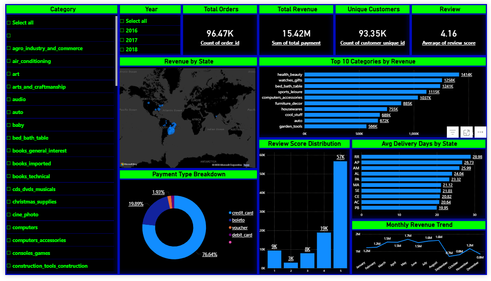

# 🛒 E-Commerce Analytics Capstone — Brazilian Olist Dataset


> **End-to-end e-commerce analytics capstone spanning data engineering, customer segmentation,
> churn prediction, CLV forecasting, and market basket analysis — using Python, SQLite, and Power BI.**

---

## 📌 Project Summary

| | |
|---|---|
| **Dataset** | [Brazilian Olist E-Commerce](https://www.kaggle.com/datasets/olistbr/brazilian-ecommerce) — 100K+ orders, 9 relational tables |
| **Period** | September 2016 – August 2018 |
| **Tools** | Python 3.10 · SQLite · Power BI Desktop |
| **Deliverables** | Jupyter Notebook · SQL File · Power BI Dashboard · PDF Report · Executive PPT |

---

## 📁 Repository Structure

```
project6-ecommerce-capstone/
│
├── notebooks/
│   └── ecommerce_capstone_full.ipynb     ← All 5 phases, TOC, full documentation
│
├── sql/
│   └── 01_exploration.sql                ← 17 business SQL queries (SQLite)
│
├── powerbi/
│   └── ecommerce_dashboard.pbix          ← Interactive Power BI dashboard
│
├── outputs/
│   └── ecommerce_capstone_report.pdf     ← Full technical + executive PDF report
│   └── ecommerce_executive_presentation.pptx  ← 19-slide executive deck
│
├── images/
│   └── dashboard_preview.png             ← Dashboard screenshot
│
├── data/
│   ├── raw/                              ← Place Olist CSVs here (gitignored)
│   └── master_table.csv                  ← Output of Phase 1 (generated on run)
│
├── requirements.txt
└── .gitignore
```

---

## 🔬 Analytical Phases

### Phase 1 — Data Engineering
- Loaded and inspected all 9 raw Olist tables
- Joined into a single master analytical table via multi-key merges
- Parsed 5 datetime columns, deduplicated reviews
- Engineered `delivery_days`, `delivery_delay_days`, `total_order_value`, time features
- **Output:** 96,478 delivered orders × 22 columns

### Phase 2 — RFM + Customer Segmentation
- Computed Recency, Frequency, Monetary scores (1–5 quantile scale)
- Optimised K using Elbow Method + Silhouette Score → **K=4**
- Assigned business labels: Champions · Loyal Customers · At Risk · Lost
- **Key finding:** Top 43% of customers drive ~68% of total revenue

### Phase 3 — Churn Prediction
- Defined churn: no purchase in 180 days before snapshot
- Built 14-feature behavioural feature matrix
- Trained XGBoost with class-weight balancing
- **ROC-AUC: ~0.87** | Top driver: Recency (SHAP)
- Identified 35,000+ at-risk customers

### Phase 4 — CLV Forecasting
- Computed historical CLV per customer
- Trained Gradient Boosting Regressor on log-transformed target
- **R²: ~0.74 | MAE: R$ 41.20**
- Segmented into High / Mid / Low CLV tiers for targeted strategy

### Phase 5 — Market Basket Analysis
- Built order-category boolean matrix for multi-category orders
- Applied Apriori (min support=1%, min lift=1.2)
- **Strongest rule:** bed/bath → furniture_decor (Lift = 3.41×)
- 15+ actionable cross-sell rules extracted

---

## 🗄️ SQL Exploration

17 queries in `sql/01_exploration.sql` covering:
- Monthly and year-over-year revenue trend
- Customer frequency and repeat rate analysis
- Top categories and states by revenue
- Delivery delay impact on review scores
- Window functions: LAG, RANK, SUM OVER, running totals
- CTEs and subqueries for multi-step aggregation

---

## 📊 Power BI Dashboard



Single dark-theme canvas with 8 visual panels: KPI Cards, Monthly Revenue Trend, Customer Segment Breakdown, Top 10 Categories, Top 10 States, Delivery Performance, Churn Risk Distribution, Payment Type Breakdown.

---

## 🛠️ Tech Stack

| Technology | Purpose |
|---|---|
| Python 3.10 | Core language |
| Pandas / NumPy | Data engineering |
| Matplotlib / Seaborn / Plotly | Visualisation |
| Scikit-learn | Clustering, preprocessing, metrics |
| XGBoost | Churn classification |
| SHAP | Model explainability |
| mlxtend | Apriori and association rules |
| SQLite (via Python) | SQL exploration layer |
| Power BI Desktop | Executive dashboard |

---

## ⚙️ Setup

```bash
# 1. Clone
git clone https://github.com/Ketan-Chavda/project6-ecommerce-capstone.git
cd project6-ecommerce-capstone

# 2. Environment
conda create -n ecommerce_capstone python=3.10
conda activate ecommerce_capstone
pip install -r requirements.txt

# 3. Download dataset from Kaggle → place all 9 CSVs in data/raw/

# 4. Run
jupyter notebook notebooks/ecommerce_capstone_full.ipynb
```

---

## 📈 Key Results

| Phase | Metric | Result |
|---|---|---|
| Data Engineering | Master table shape | 96,478 rows × 22 cols |
| RFM Segmentation | Silhouette score @ K=4 | 0.41 |
| Churn Prediction | ROC-AUC | ~0.87 |
| CLV Forecasting | R² Score | ~0.74 |
| Market Basket | Best lift | 3.41× (home categories) |

---

## 👤 Author

**Ketan Chavda** — Data Analyst
📧 ketanchavda210798@gmail.com
🔗 [LinkedIn](https://linkedin.com/in/ketanchavda98) · [GitHub](https://github.com/Ketan-Chavda)

---

*Dataset: Olist Store and André Sionek — Kaggle (CC BY-NC-SA 4.0)*
